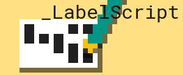

Welcome to **LabelScript**, an Untangled 2016 project utilising a Dymo LabelWriter 400 to create an implementation of a 'Logo' like language using JavaScript and a camera.

# Features

- **Web based editor** 
Web based editor that allows a user to create a program Labelscript and print it out.

- **Labelscript importer**
A camera system that reads in Labelscript and converts it.

- **Labelscript interpreter**
An interpreter that will execute the imported labelscript code

# Team Members

- **Harry**
- **Ben**
- **Nat**

# Equipment

- **Raspberry Pi**
- **Camera**
- **Stepper**
- **Dymo LabelWriter 400**
- **Dymo 99012 Labels**
- **Linux server**

#How to use the Dymo LabelWriter 400

*a hopefully helpful guide by Nat*

I assume you're using Linux. If not, YER ON YER OWN. First, go to [here](http://www.dymo.com/en-GB/dymo-label-sdk-and-cups-drivers-for-linux-dymo-label-sdk-cups-linux-p--1) and click the "DOWNLOAD" button (hard to miss, the rest of the page is broken). Then figure out what to do from its `install.md`.

You probably need to set up the label maker, too. Plug it into both your computer and some power. It should register itself as a printer (Assuming you're using Ubuntu or something simple. If you're on Arch, you can probably fix your own problems.) - but you need to do a little more. Find whichever thing lets you set what printer it is and choose Dymo → LabelWriter 400. Now that that's set up, go to advanced printer settings and change the paper/label size to `99012 Large Address`. This is crucial to it printing correctly.

Now, to the terminal. Here is a default command that will print something:

    lpr -o landscape -o PageSize=24_mm__1___Label__Auto_ -o cpi=3 -o lpi=4 [file path]

Let's break it down with some extra settings:

    lpr

The driver command. It's actually made by Apple. You can tell from its appalling documentation.

    -o landscape

Sets the orientation. You can also set it to `portrait`.

    -o PageSize=24_mm__1___Label__Auto_

I don't really know what this does, but it works, so leave it.

    -o cpi=3

You can leave this out if you're just printing any old text or image, but it's important to scale up the boxes for LabelScript. It sets the columns per inch, and I'm almost certain the developers of this tool were trying to find the most utterly useless unit of measurement they could.

    -o lpi=4

Again, you should leave this out normally. It's lines per inch.

    [file path]

Put the path to the file you want to print here. You can *only* print text files (`.txt`) and images (`.png` definitely works, probably jpeg too). Do not attempt to print rich text, etc. - **if you want to print something more advanced than plain text, use an image** (otherwise it will print the XML or whatever and waste *all* the labels).

That's about it. Ask me if you have any problems and I'll ~~begrudgingly~~ gladly help. There also might be some other options, but, like I said, the documentation is awful so nobody has any idea what they do.
